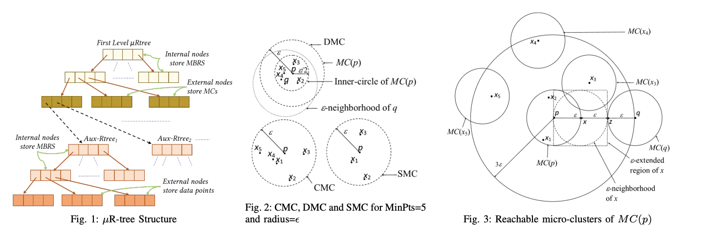
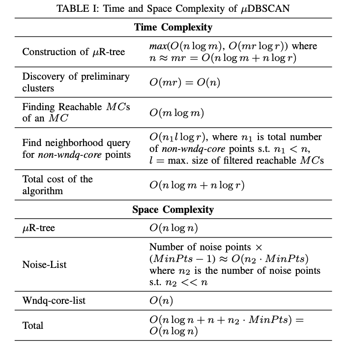
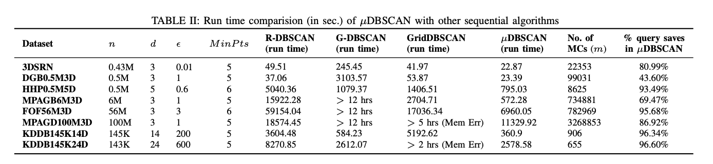
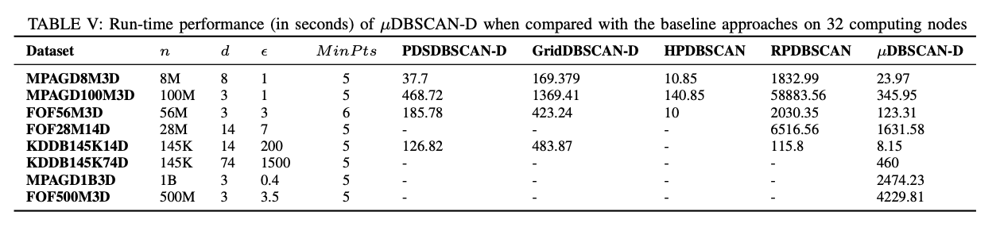
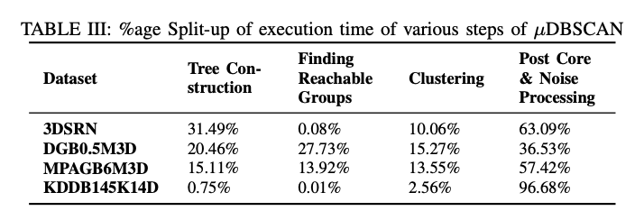
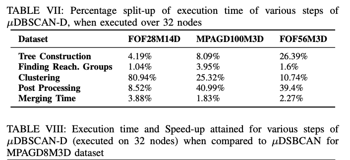
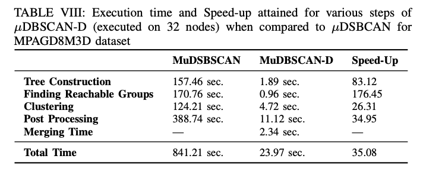
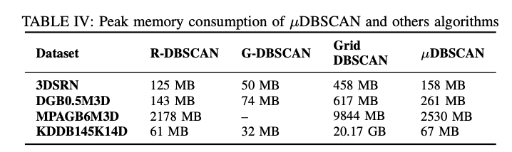
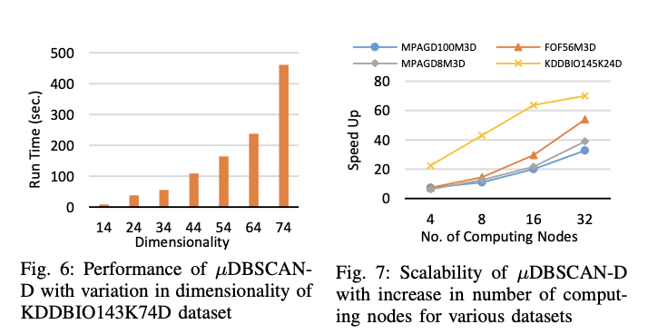

# MuDBSCAN
A fast, exact, and scalable algorithm for DBSCAN clustering.
This repository contains the implementation for the distributed spatial clustering algorithm proposed in the paper `μDBSCAN: An Exact Scalable DBSCAN Algorithm for Big Data Exploiting Spatial Locality`

We propose an extremely efficient way to compute neighbourhood queries that not only improves the average time complexity but exhibits super-linear speed up on large astronomical datasets. Using the distributed variant of our algorithm, we were **able to cluster 1 billion 3D points in under 42 minutes**

## Setup
1. Clone the repository
2. Install dependencies (gcc/g++, [open-mpi](https://www.open-mpi.org/))
3. To run the distributed variant of the algorithm, a MPI cluster has to be [setup](https://mpitutorial.com/tutorials/running-an-mpi-cluster-within-a-lan/)

## Running the algorithm
1. Re-format your input according to the template below and store the file in a folder `datasets`

```
<number_of_data_points>
<dimension>
<data_1_dim_1> <data_1_dim_2> ... <data_1_dim_dimension>
.
.
.
...
```

For example
```
10
2
1 20
2 20
2 19
8 15
8 14
7 15
9 14
9 17
12 17
11 18
```

2. Running the sequential algorithm
```shell
./runs.sh <dataset> <epsilon> <minpts> <MinDegree Rtree> <MaxDegree Rtree>

where
- <dataset> is the name of the file formatted according to 1.
- <epsilon> represents the neighbourhood parameter (Anything within epislon distance from given point is considered a neighbour)
- <minpts> represents the density parameter. It defines the minimum number of neighbours required for a point to be classified as `dense`
- <MinDegree Rtree> and <MaxDegree Rtree> hyper-parameters and correspond to the minimum and maximum degree of the custom defined μC-RTree
```

3. Running the distributed algorithm
```shell
./rund.sh <dataset> <epsilon> <minpts> <nodes> <hostfile> <MinDegree Rtree> <MaxDegree Rtree>

where <dataset>, <epsilon>, <minpts>, <MinDegree, Rtree>, <MaxDegree Rtree> are same as before and
- <nodes> number of nodes to use within the cluster
- <hostfile> list of nodes configured in the server (hostnames)

```

## Overview
### Overview of the Algorithm
|  |

### Time complexity
|

## Results
1. **Proposed sequential algorithm compared with existing sequential clustering algorithms**


2. **Proposed algorithm compared with existing clustering algorithms on 32 nodes**


3. **Run-time split up across various steps in μDBSCAN**
**Sequential algorithm split up**


- **Distributed algorithm split up**


4. **Speed up across various steps in μDBSCAN**


5. **Peak memory consumption of μDBSCAN**


6. **Scalability of μDBSCAN**


